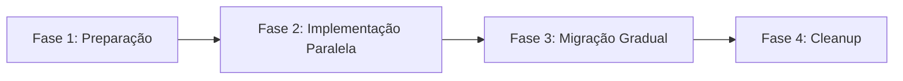

# Guia de Migração: Ranges → Bitmap+BitSet

## 🎯 Estratégia de Migração

### Fases da Migração



## 📋 Fase 1: Preparação

### 1.1 Análise do Sistema Atual

```typescript
// Script de análise para entender o estado atual
class MigrationAnalyzer {
  static async analyzeCampaign(campaignId: string) {
    console.log(`📊 Analisando campanha ${campaignId}...`);
    
    // Coletar dados atuais
    const campaign = await Campaign.findById(campaignId);
    const ranges = await NumberRange.find({ campaignId });
    const partitions = await RangePartition.find({ campaignId });
    const soldNumbers = await NumberStatus.find({ campaignId });
    
    const analysis = {
      totalNumbers: campaign.totalNumbers,
      currentStorage: this.calculateCurrentStorage(ranges, partitions, soldNumbers),
      bitmapStorage: Math.ceil(campaign.totalNumbers / 8),
      savingsPercent: 0,
      migrationComplexity: 'medium'
    };
    
    analysis.savingsPercent = 
      ((analysis.currentStorage - analysis.bitmapStorage) / analysis.currentStorage) * 100;
    
    console.log('📈 Análise concluída:', analysis);
    return analysis;
  }
  
  static calculateCurrentStorage(ranges: any[], partitions: any[], sold: any[]): number {
    // Cálculo aproximado do espaço atual
    const rangeSize = ranges.length * 200; // bytes por range
    const partitionSize = partitions.length * 300; // bytes por partição  
    const soldSize = sold.length * 100; // bytes por número vendido
    
    return rangeSize + partitionSize + soldSize;
  }
}
```

### 1.2 Criação do PoC (Proof of Concept)

```typescript
// Implementação completa do PoC
class BitmapPoC {
  static async createFromExistingCampaign(campaignId: string): Promise<void> {
    console.log(`🧪 Criando PoC para campanha ${campaignId}...`);
    
    // 1. Buscar dados atuais
    const campaign = await Campaign.findById(campaignId);
    const soldNumbers = await NumberStatus.find(
      { campaignId }, 
      { number: 1 }
    ).lean();
    
    // 2. Criar bitmap inicial
    const bitmap = Buffer.alloc(Math.ceil(campaign.totalNumbers / 8), 0xFF);
    
    // 3. Marcar números vendidos
    let soldCount = 0;
    for (const doc of soldNumbers) {
      const number = parseInt(doc.number);
      if (RiffaBitmapService.markNumberSold(bitmap, number)) {
        soldCount++;
      }
    }
    
    // 4. Salvar PoC (collection separada)
    await mongoose.connection.collection('bitmap_poc').insertOne({
      campaignId: new mongoose.Types.ObjectId(campaignId),
      totalNumbers: campaign.totalNumbers,
      bitmap,
      availableCount: campaign.totalNumbers - soldCount,
      createdAt: new Date(),
      migratedFrom: 'ranges'
    });
    
    console.log(`✅ PoC criado: ${soldCount} números migrados`);
  }
  
  static async testPerformance(campaignId: string): Promise<void> {
    console.log(`⚡ Testando performance do PoC...`);
    
    const poc = await mongoose.connection.collection('bitmap_poc')
      .findOne({ campaignId: new mongoose.Types.ObjectId(campaignId) });
    
    // Teste 1: Verificação de disponibilidade
    const start1 = Date.now();
    for (let i = 0; i < 10000; i++) {
      const randomNum = Math.floor(Math.random() * poc.totalNumbers);
      RiffaBitmapService.isNumberAvailable(poc.bitmap, randomNum);
    }
    const time1 = Date.now() - start1;
    
    // Teste 2: Seleção aleatória
    const start2 = Date.now();
    const randomNumbers = RiffaBitmapService.sampleRandomNumbers(
      poc.bitmap, 
      poc.totalNumbers, 
      1000
    );
    const time2 = Date.now() - start2;
    
    // Teste 3: Contagem
    const start3 = Date.now();
    const count = RiffaBitmapService.countAvailableBits(poc.bitmap, poc.totalNumbers);
    const time3 = Date.now() - start3;
    
    console.log(`📊 Resultados dos testes:`);
    console.log(`   • 10k verificações: ${time1}ms`);
    console.log(`   • Seleção 1k números: ${time2}ms`);
    console.log(`   • Contagem total: ${time3}ms`);
    console.log(`   • Números disponíveis: ${count}`);
  }
}
```

## 🔄 Fase 2: Implementação Paralela

### 2.1 Interface Unificada

```typescript
// Interface comum para ambas as estratégias
interface NumberManagementStrategy {
  isNumberAvailable(campaignId: string, number: number): Promise<boolean>;
  sellNumbers(campaignId: string, numbers: number[]): Promise<SellResult>;
  getRandomNumbers(campaignId: string, count: number): Promise<number[]>;
  getAvailableCount(campaignId: string): Promise<number>;
  getStats(campaignId: string): Promise<CampaignStats>;
}

// Implementação para Ranges (existente)
class RangeStrategy implements NumberManagementStrategy {
  async isNumberAvailable(campaignId: string, number: number): Promise<boolean> {
    // Implementação atual usando NumberStatus + NumberRange
    const status = await NumberStatus.findOne({ campaignId, number: number.toString() });
    if (status) return false;
    
    return await NumberRange.isNumberInRange(campaignId, number);
  }
  
  // ... outras implementações atuais
}

// Implementação para Bitmap (nova)
class BitmapStrategy implements NumberManagementStrategy {
  async isNumberAvailable(campaignId: string, number: number): Promise<boolean> {
    const rifa = await RiffaBitmap.findOne({ campaignId });
    if (!rifa) throw new Error('Rifa não encontrada');
    
    return RiffaBitmapService.isNumberAvailable(rifa.bitmap, number);
  }
  
  async sellNumbers(campaignId: string, numbers: number[]): Promise<SellResult> {
    return await RiffaBitmapService.sellNumbers(campaignId, numbers);
  }
  
  async getRandomNumbers(campaignId: string, count: number): Promise<number[]> {
    return await RiffaBitmapService.getRandomNumbers(campaignId, count);
  }
  
  async getAvailableCount(campaignId: string): Promise<number> {
    const rifa = await RiffaBitmap.findOne({ campaignId });
    return rifa ? rifa.availableCount : 0;
  }
  
  async getStats(campaignId: string): Promise<CampaignStats> {
    const rifa = await RiffaBitmap.findOne({ campaignId });
    if (!rifa) throw new Error('Rifa não encontrada');
    
    return RiffaBitmapService.generateStats(rifa.bitmap, rifa.totalNumbers);
  }
}
```

### 2.2 Factory Pattern

```typescript
// Factory para escolher estratégia
class NumberManagementFactory {
  static getStrategy(campaignId: string): NumberManagementStrategy {
    // Verificar se campanha usa bitmap (via feature flag ou configuração)
    const usesBitmap = this.campaignUsesBitmap(campaignId);
    
    if (usesBitmap) {
      return new BitmapStrategy();
    } else {
      return new RangeStrategy();
    }
  }
  
  private static campaignUsesBitmap(campaignId: string): boolean {
    // Implementar lógica de decisão:
    // - Feature flag global
    // - Configuração por campanha
    // - Lista de campanhas migradas
    
    const migratedCampaigns = process.env.BITMAP_CAMPAIGNS?.split(',') || [];
    return migratedCampaigns.includes(campaignId);
  }
}

// Usage
const strategy = NumberManagementFactory.getStrategy(campaignId);
const available = await strategy.isNumberAvailable(campaignId, 123456);
```

### 2.3 Camada de Abstração nos Controllers

```typescript
// Controller atualizado para usar factory
class CampaignController {
  async purchaseNumbers(req: Request, res: Response) {
    try {
      const { campaignId, numbers, userId } = req.body;
      
      // Usar factory para obter estratégia correta
      const strategy = NumberManagementFactory.getStrategy(campaignId);
      
      // Operação transparente (funciona com ambas as estratégias)
      const result = await strategy.sellNumbers(campaignId, numbers);
      
      res.json({
        success: true,
        soldNumbers: result.soldNumbers,
        availableCount: result.availableCount
      });
      
    } catch (error) {
      res.status(500).json({ success: false, error: error.message });
    }
  }
  
  async getRandomNumbers(req: Request, res: Response) {
    try {
      const { campaignId } = req.params;
      const { count } = req.query;
      
      const strategy = NumberManagementFactory.getStrategy(campaignId);
      const numbers = await strategy.getRandomNumbers(campaignId, parseInt(count));
      
      res.json({
        success: true,
        numbers,
        strategy: strategy.constructor.name
      });
      
    } catch (error) {
      res.status(500).json({ success: false, error: error.message });
    }
  }
}
```

## 🚀 Fase 3: Migração Gradual

### 3.1 Script de Migração

```typescript
class CampaignMigrator {
  static async migrateToBitmap(campaignId: string): Promise<void> {
    console.log(`🔄 Iniciando migração da campanha ${campaignId}...`);
    
    const session = await mongoose.startSession();
    session.startTransaction();
    
    try {
      // 1. Validar se campanha existe e não está migrada
      const campaign = await Campaign.findById(campaignId).session(session);
      if (!campaign) throw new Error('Campanha não encontrada');
      
      const existingBitmap = await RiffaBitmap.findOne({ campaignId }).session(session);
      if (existingBitmap) throw new Error('Campanha já migrada');
      
      // 2. Criar bitmap inicial (todos disponíveis)
      console.log('📊 Criando bitmap inicial...');
      const bytesNeeded = Math.ceil(campaign.totalNumbers / 8);
      const bitmap = Buffer.alloc(bytesNeeded, 0xFF);
      
      // Ajustar bits extras no final
      const extraBits = (bytesNeeded * 8) - campaign.totalNumbers;
      if (extraBits > 0) {
        const lastByteIndex = bytesNeeded - 1;
        const mask = (1 << (8 - extraBits)) - 1;
        bitmap[lastByteIndex] &= mask;
      }
      
      // 3. Buscar números já vendidos/reservados
      console.log('🔍 Coletando números vendidos...');
      const soldNumbers = await NumberStatus.find(
        { campaignId },
        { number: 1 }
      ).session(session).lean();
      
      // 4. Marcar números como vendidos no bitmap
      console.log(`📝 Marcando ${soldNumbers.length} números como vendidos...`);
      let markedCount = 0;
      for (const doc of soldNumbers) {
        const number = parseInt(doc.number);
        if (RiffaBitmapService.markNumberSold(bitmap, number)) {
          markedCount++;
        }
      }
      
      // 5. Criar documento bitmap
      console.log('💾 Salvando bitmap...');
      const riffaBitmap = await RiffaBitmap.create([{
        campaignId,
        totalNumbers: campaign.totalNumbers,
        bitmap,
        availableCount: campaign.totalNumbers - markedCount
      }], { session });
      
      // 6. Marcar campanha como migrada
      await Campaign.updateOne(
        { _id: campaignId },
        { 
          $set: { 
            usesBitmap: true,
            migratedAt: new Date()
          }
        }
      ).session(session);
      
      await session.commitTransaction();
      
      console.log(`✅ Migração concluída!`);
      console.log(`   • Total de números: ${campaign.totalNumbers}`);
      console.log(`   • Números vendidos: ${markedCount}`);
      console.log(`   • Números disponíveis: ${campaign.totalNumbers - markedCount}`);
      console.log(`   • Tamanho do bitmap: ${bytesNeeded} bytes`);
      
    } catch (error) {
      await session.abortTransaction();
      console.error(`❌ Erro na migração:`, error);
      throw error;
    } finally {
      session.endSession();
    }
  }
  
  static async validateMigration(campaignId: string): Promise<boolean> {
    console.log(`🔍 Validando migração da campanha ${campaignId}...`);
    
    // Buscar dados de ambos os sistemas
    const ranges = await NumberRange.findOne({ campaignId });
    const bitmap = await RiffaBitmap.findOne({ campaignId });
    const soldNumbers = await NumberStatus.find({ campaignId }).lean();
    
    if (!bitmap) {
      console.error('❌ Bitmap não encontrado');
      return false;
    }
    
    // Validar contagens
    const expectedSold = soldNumbers.length;
    const expectedAvailable = ranges.endNumber - ranges.startNumber + 1 - expectedSold;
    
    if (bitmap.availableCount !== expectedAvailable) {
      console.error(`❌ Contagem incorreta: esperado ${expectedAvailable}, encontrado ${bitmap.availableCount}`);
      return false;
    }
    
    // Validar números específicos (amostra)
    console.log('🎯 Validando amostra de números...');
    const sampleSize = Math.min(1000, soldNumbers.length);
    const sampleNumbers = soldNumbers.slice(0, sampleSize);
    
    for (const doc of sampleNumbers) {
      const number = parseInt(doc.number);
      const isSoldInBitmap = !RiffaBitmapService.isNumberAvailable(bitmap.bitmap, number);
      
      if (!isSoldInBitmap) {
        console.error(`❌ Número ${number} deveria estar vendido no bitmap`);
        return false;
      }
    }
    
    console.log('✅ Validação concluída com sucesso!');
    return true;
  }
}
```

### 3.2 Rollback Strategy

```typescript
class MigrationRollback {
  static async rollbackToBitmap(campaignId: string): Promise<void> {
    console.log(`⏪ Fazendo rollback da campanha ${campaignId}...`);
    
    const session = await mongoose.startSession();
    session.startTransaction();
    
    try {
      // 1. Marcar campanha para usar ranges novamente
      await Campaign.updateOne(
        { _id: campaignId },
        { 
          $unset: { usesBitmap: 1, migratedAt: 1 }
        }
      ).session(session);
      
      // 2. Opcional: remover bitmap (manter para debug)
      // await RiffaBitmap.deleteOne({ campaignId }).session(session);
      
      await session.commitTransaction();
      
      console.log('✅ Rollback concluído. Campanha voltou a usar ranges.');
      
    } catch (error) {
      await session.abortTransaction();
      throw error;
    } finally {
      session.endSession();
    }
  }
}
```

## 🧹 Fase 4: Cleanup

### 4.1 Limpeza dos Dados Antigos

```typescript
class MigrationCleanup {
  static async cleanupAfterMigration(campaignId: string): Promise<void> {
    console.log(`🧹 Limpando dados antigos da campanha ${campaignId}...`);
    
    // Verificar se migração foi bem-sucedida
    const bitmap = await RiffaBitmap.findOne({ campaignId });
    if (!bitmap) {
      throw new Error('Bitmap não encontrado. Não é seguro fazer cleanup.');
    }
    
    // Validar integridade uma última vez
    const isValid = await CampaignMigrator.validateMigration(campaignId);
    if (!isValid) {
      throw new Error('Validação falhou. Não é seguro fazer cleanup.');
    }
    
    console.log('📊 Coletando estatísticas antes do cleanup...');
    const rangeCount = await NumberRange.countDocuments({ campaignId });
    const partitionCount = await RangePartition.countDocuments({ campaignId });
    
    // CUIDADO: Esta operação é irreversível!
    console.log('⚠️  ATENÇÃO: Removendo dados antigos (irreversível)...');
    
    // Remover ranges (manter NumberStatus para auditoria)
    await NumberRange.deleteMany({ campaignId });
    await RangePartition.deleteMany({ campaignId });
    
    console.log(`✅ Cleanup concluído:`);
    console.log(`   • ${rangeCount} ranges removidos`);
    console.log(`   • ${partitionCount} partições removidas`);
    console.log(`   • NumberStatus mantido para auditoria`);
  }
  
  static async generateMigrationReport(campaignId: string): Promise<void> {
    console.log(`📊 Gerando relatório de migração...`);
    
    const campaign = await Campaign.findById(campaignId);
    const bitmap = await RiffaBitmap.findOne({ campaignId });
    const soldCount = await NumberStatus.countDocuments({ campaignId });
    
    const report = {
      campaignId,
      campaignTitle: campaign.title,
      totalNumbers: campaign.totalNumbers,
      migratedAt: campaign.migratedAt,
      bitmapSize: bitmap.bitmap.length,
      availableNumbers: bitmap.availableCount,
      soldNumbers: soldCount,
      storageReduction: this.calculateStorageReduction(campaign.totalNumbers, soldCount),
      performanceGain: 'Estimado 10-50x mais rápido'
    };
    
    console.log('📈 Relatório de migração:', JSON.stringify(report, null, 2));
    
    // Salvar relatório
    await mongoose.connection.collection('migration_reports').insertOne({
      ...report,
      generatedAt: new Date()
    });
  }
  
  private static calculateStorageReduction(total: number, sold: number): string {
    // Estimativa do tamanho antes vs depois
    const oldSize = sold * 100; // bytes por NumberStatus
    const newSize = Math.ceil(total / 8); // bytes do bitmap
    const reduction = ((oldSize - newSize) / oldSize) * 100;
    
    return `${Math.round(reduction)}% de redução`;
  }
}
``` 